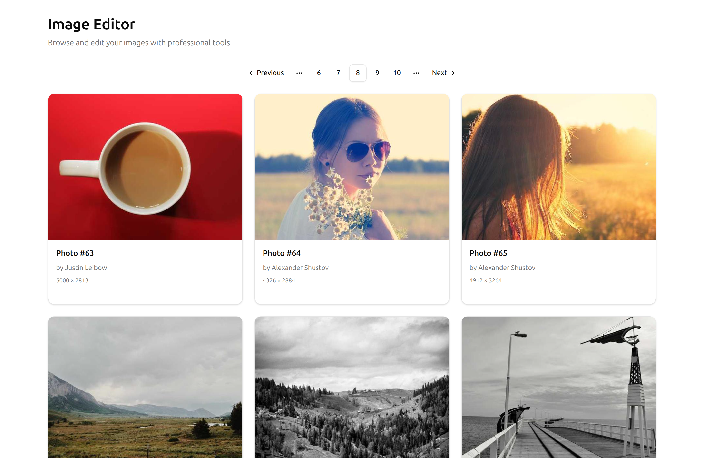
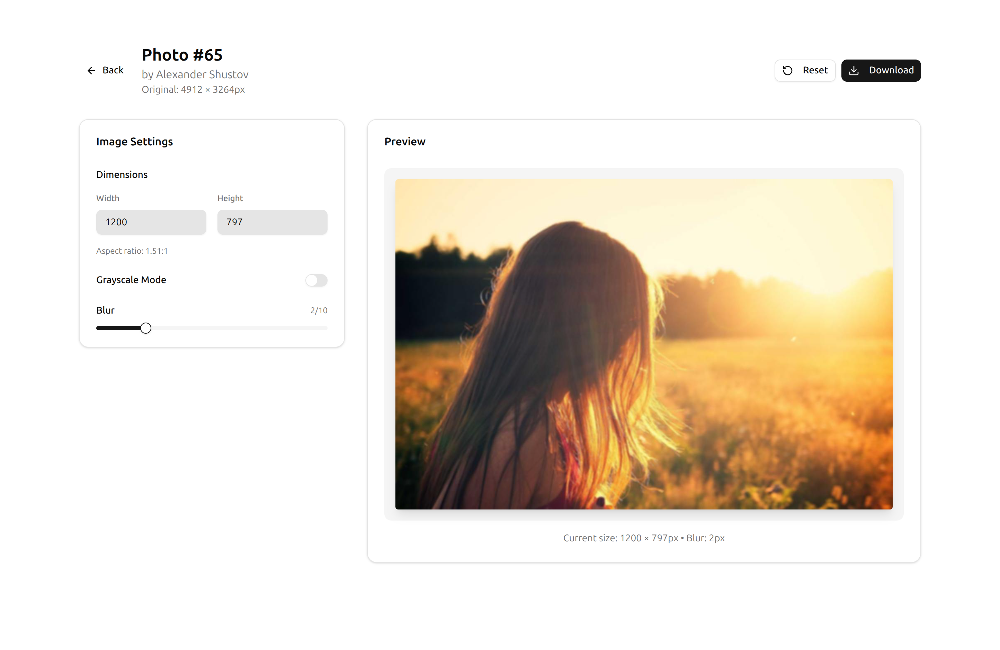

# Image Studio Demo

Image Studio Demo is a Next.js application for browsing the Picsum Photos catalog, fine-tuning image settings, and downloading tailored assets. The project highlights a modern editing workflow built with the App Router, TypeScript, and a component-driven UI system.

## Live Demo

- https://alexeypopovua.github.io/image-studio-demo/

## Screenshots





## Key Features

- Paginated image gallery powered by the Picsum Photos API.
- Editor with live preview, dimension controls, grayscale toggle, and blur levels.
- Download pipeline that reflects user-selected settings.
- Responsive layout and accessible controls for keyboard and screen reader users.

## Tech Stack

- **Framework:** Next.js (App Router)
- **Language:** TypeScript
- **UI Library:** React
- **Styling:** Tailwind CSS + Shadcn UI components
- **Package Manager:** pnpm

## Getting Started

### Prerequisites

- Node.js 22
- pnpm

### Installation

Clone the repository and install dependencies:

```bash
git clone <repository-url>
cd image-studio-demo
pnpm install
```

### Development

- `pnpm dev` – starts the Next.js dev server with Turbopack at http://localhost:3000.
- `pnpm lint` – runs ESLint using the Next.js recommended rules.
- `pnpm check:ts` – performs a no-emit TypeScript check.
- `pnpm test` – executes the Jest unit test suite.

### Production Build

```bash
pnpm build
pnpm start
```

The production build outputs static assets to `out/`, and `pnpm start` serves the last build locally.

## Project Structure Highlights

- `src/app` – App Router layouts, pages, and global styles.
- `src/components` – Feature- and UI-focused React components.
- `src/lib` – Shared utilities such as pagination helpers and Picsum API adapters.
- `docs/` – Screenshots used in this README.

## Contributing

Run `pnpm lint && pnpm check:ts` before submitting changes. Follow Conventional Commit messages (e.g., `feat:`, `chore:`) and include screenshots when altering the UI.
